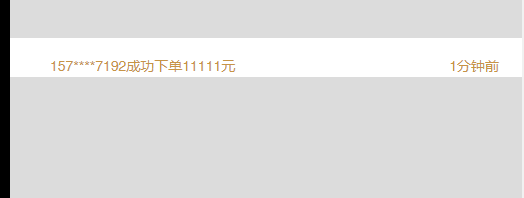

自己封装了一个vue滚动消息插件:bowtie:，之前在查找的资料基本都是基于jquery的，基于dom的，自己编写一款无依赖，不基于dom操作得消息滚动插件，
主要实现思路是两个ul的拼接和连接、更新，避免了数组更新时的闪屏问题和滚动动画效果更完美:trollface:。

<!-- more -->

## 模板
``` html
<div class="roll-msg-box"
      :style="{'height': rollHeight}">
  <div ref="rollmsgul"
        class="roll-msg-limit-box"
        :style="[{marginTop: -(ulMarginTop) + 'px'}]">
    <ul class="roll-msg"
        v-for="(item, index) in rollData"
        :key="index">
      <li v-for="(items, indexs) in item"
          :key="indexs"
          :style="[liStyle]">
        <span v-if="!slotShow">{{ items }}</span>
        <slot v-else :item="items"></slot>
      </li>
    </ul>
  </div>
  </div>
```
## 初始化两条ul数据

``` javascript
created() {
  this.$data.rollData = [this.listData, this.listData];
}
```

## 滚动方法

``` javascript
ScrollUp() {
  let _this = this;
  // console.log('执行方法');
  this.$nextTick(() => {
    // 异步获取数据高度问题
    _this.$data.offsetHeight = _this.$refs.rollmsgul.offsetHeight;
    // console.log(_this.$refs.rollmsgul.offsetHeight);
    _this.$data.rollDataLength = _this.$data.rollData[0].length * _this.$data.rollData.length || 1;
  });
  // console.log(this.intNum);
  this.intNum = setInterval(() => {
    // 每隔一个li停顿一下
    if (_this.$data.ulMarginTop % (_this.$data.offsetHeight/_this.$data.rollDataLength) === 0) {
      // console.log(_this.$data.ulMarginTop + 'ulMarginTop');
      // console.log(_this.$data.offsetHeight + '_this.$data.offsetHeight');
      // console.log(_this.$data.rollDataLength + '_this.$data.rollDataLength');
      // console.log(_this.$data.offsetHeight/_this.$data.rollDataLength + '每段');
      // console.log(_this.$data.rollData);
      _this.$data.rollHeight = _this.$data.offsetHeight/_this.$data.rollDataLength + 'px';
      // console.log(_this.$data.rollHeight);
      clearInterval(_this.intNum);
      _this.intTimeOut = setTimeout(() => {
        _this.ScrollUp();
        _this.$data.ulMarginTop++;
      }, _this.rollTime);
    }
    // 循环ul
    if (_this.$data.ulMarginTop === _this.$data.offsetHeight) {
      _this.$data.ulMarginTop = 0;
    } else if (_this.$data.ulMarginTop === (_this.$data.offsetHeight / 2  + _this.$data.offsetHeight / _this.$data.rollDataLength)) {
    // 循环ul 到达第二个列表的第一个结束时 把第一个列表拼接到第二个后面
      _this.rollData.push(_this.rollData[0]);
      _this.rollData.shift();
      // 更新当前外层盒子的marigntop 否则会将整个列表替换到之前的位置
      _this.$data.ulMarginTop = _this.$data.offsetHeight / _this.$data.rollDataLength;
      _this.$data.ulMarginTop++;
    } else {
      _this.$data.ulMarginTop++;
    }
  }, 20);
}
```
## 异步更新

``` javascript
watch: {
  // 如果数据是从后端拉取回来异步更新的
  listData(val) {
    this.$data.rollData = [val, val]; // 初始化两条ul数据
    if (this.intNum) {
      clearInterval(this.intNum);
    }
    this.ScrollUp();
  }
}
```
## 事件清除

``` javascript
beforeDestroy() {
  if (this.intTimeOut) {
    clearTimeout(this.intTimeOut);
  }
  if (this.intNum) {
    clearInterval(this.intNum);
  }
}
```

## 插件使用说明:yum:

### vue-news-scroll
[](https://www.npmjs.com/package/vue-news-scroll)

-  vue 滚动消息插件👫
-  滚动样式
-  滚动时间间隔
-  滚动自定义插槽
-  支持异步获取滚动数据

### npm

``` bash

# npm install
npm install vue-news-scroll --save

```
### 引入

在main.js中引入

```js
import vueNewsScroll from 'vue-news-scroll'
Vue.use(vueNewsScroll)
```

### 使用

####  滚动消息

``` html
<vue-news-scroll
  :list-data="listData"
  :li-style="liStyle"
  :rollTime="1600">
</vue-news-scroll>
```

| 参数 | 类型 | 备注 | 默认值 |
|  ------ | ------ | ------ | ------ |
| listData | Array | 循环数据 | [] |
| liStyle | Object | 循环数据样式<br>（驼峰命名：backgroundColor） | {} |
| rollTime | Number | 循环数据停顿时间 | 2000 |
| slotShow | Boolean | 是否使用自定义插槽 | false |

###  使用自定义插槽

- 设置属性slotShow为true

``` html
<vue-news-scroll
  :list-data="listData"
  :li-style="liStyle"
  :slot-show="true"
  :rollTime="1600">
  <template slot-scope="scope">
    <div style="position:relative;">
      {{ scope.item.phone }}
      成功下单
      {{ scope.item.money }}元
      <span style="position:absolute;right:0;">
        {{ scope.item.time }}
      </span>
    </div>
  </template>
</vue-news-scroll>
```

属性举例

```
listData: [
  { money: '14000', name: '许小姐', phone: '157****7192', time: '1分钟前' },
  { money: '5000', name: '巢先生', phone: '136****6246', time: '2分钟前' }
]
```

```
liStyle: {
  backgroundColor: '#FFFFFF',
  color: '#C79446',
  fontSize: '14px',
  padding: '10px', // 最好设置一点padding
  paddingLeft: '40px',
  paddingRight: '40px'
}
```

### 效果展示

录制gif出来效果有点卡顿，实际没有，我也不知道为什么

<center></center><br/>


源码地址：[https://github.com/liqin1059/vue-news-scroll](https://github.com/liqin1059/vue-news-scroll)
:partly_sunny: