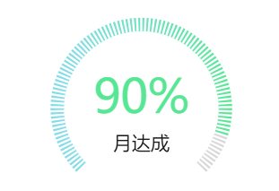
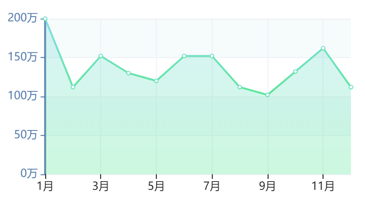

vue中使用echarts仪表盘

```
npm install echarts --save
```
在组件中引入

```
import echarts from 'echarts';
```
## 仪表盘（渐变背景实现）

<center></center><br/>

html创建dom节点
```
<div id="gauge"></div>
```
定义仪表盘数据
```
gaugeData: {
  id: 'gauge',
  title: '月达成',
  startColor: '#84DCE7',
  endColor: '#57E794',
  value: 80
}
```
方法中实例化echarts
```
// 仪表盘图
    drawgauge(data) {
      this.gaugeCharts = echarts.init(document.getElementById(data.id));
      this.$data.gaugeOptions = {
        grid: {
          x: 0,
          y: 0,
          x2: 0,
          y2: 0
        },
        tooltip: {
          formatter: '{a} <br/>{b} : {c}%'
        },
        toolbox: {
          show: false,
          feature: {
            mark: { show: false },
            restore: { show: true },
            saveAsImage: { show: true }
          }
        },
        series: [
          {
            name: '业务指标',
            type: 'gauge',
            min: 0,
            max: 100,
            // 去掉多余的分段
            splitNumber: 1,
            axisLine: {
              lineStyle: {
                width: 10,
                color: [
                  [data.value / 100, new echarts.graphic.LinearGradient(0, 0, 1, 0, [
                    {
                      offset: 0.1,
                      color: data.startColor
                    },
                    {
                      offset: 1,
                      color: data.endColor
                    }
                  ])
                  ],
                  [1, '#d7d7d7']
                ]
              }
            },
            splitLine: {
              show: false
            },
            axisLabel: { // 坐标轴小标记
              show: false,
              textStyle: {
                color: '#57e794'
              }
            },
            axisTick: {
              // 刻度长度与轴线宽度一致，达到分隔的效果
              length: 10,
              // 增加刻度密度
              splitNumber: 100,
              lineStyle: {
                // 增加刻度宽度
                width: 1.6,
                color: '#fff'
              }
            },
            pointer: {
              show: false,
              length: '75%',
              width: 5,
              color: '#57e794'
            },
            title: {
              textStyle: { // 其余属性默认使用全局文本样式，详见TEXTSTYLE
                // fontWeight: 'bolder',
                fontSize: 26,
                color: data.endColor,
                align: 'center',
                baseline: 'bottom',
                shadowColor: '#FFFFFF',
                shadowBlur: 10
              }
            },
            detail: {
              formatter: data.title,
              borderWidth: 0,
              textStyle: {
                color: '#1a1a1a',
                fontSize: 14,
                baseline: 'top'
              }
            },
            data: [
              {
                value: data.value,
                name: ''
                // name: `${data.value}%`
              }
            ],
            markPoint: {

            }
          }
        ]
      };
      this.gaugeCharts.setOption(this.$data.gaugeOptions);
    }
```
生成仪表盘图
```
this.drawgauge(this.$data.gaugeData);
```
## 折线面积图（渐变）

<center></center><br/>

html创建dom节点
```
<div id="folder"></div>
```
定义折线图数据
```
folderData: {
  id: 'folder',
  name: '余额',
  startColor: '#84DCE7',
  endColor: '#57E794',
  value: [200, 400, 500, 450, 600, 700, 300, 400, 900, 500, 600, 300],
  xAxis: ['1月', '2月', '3月', '4月', '5月', '6月', '7月', '8月', '9月', '10月', '11月', '12月']
}
```
方法中实例化echarts
```
// 折线图
    drawFolder(data) {
      this.folderCharts = echarts.init(document.getElementById(data.id));
      this.$data.folderOptions = {
        grid: {
          x: 60,
          y: 10,
          x2: 20,
          y2: 20
        },
        title: {
          show: false,
          text: '',
          subtext: ''
        },
        tooltip: {
          trigger: 'axis'
        },
        legend: {
          show: false,
          data: ['放款']
        },
        toolbox: {
          show: false,
          feature: {
            mark: { show: true },
            dataView: { show: true, readOnly: false },
            magicType: {
              show: true,
              type: ['line', 'bar']
            },
            restore: { show: true },
            saveAsImage: { show: true }
          }
        },
        calculable: true,
        xAxis: [
          {
            type: 'category',
            boundaryGap: false,
            data: data.xAxis,
            axisLine: {
              show: false,
              lineStyle: {
                color: '#1A1A1A',
                width: 0,
                type: 'dashed'
              }
            },
            splitLine: { // 网格样式
              show: true,
              lineStyle: {
                color: ['#EFF1F5'],
                width: 1,
                type: 'solid'
              }
            }
          }
        ],
        yAxis: [
          {
            type: 'value',
            axisLabel: {
              formatter: '{value}万'
            },
            axisLine: {
              lineStyle: {
                color: '#4F77A9',
                width: 2,
                type: 'solid'
              }
            },
            splitLine: { // 网格样式
              show: true,
              lineStyle: {
                color: ['#EFF1F5'],
                width: 1,
                type: 'solid'
              }
            },
            splitArea: {
              show: true,
              areaStyle: {
                color: [
                  '#FFFFFF',
                  '#F6FBFC'
                ]
              }
            }
          }
        ],
        series: [
          {
            name: data.name,
            type: 'line',
            data: data.value,
            markPoint: {
            },
            markLine: {
            },
            itemStyle: {
              normal: {
                areaStyle: {
                  type: 'default',
                  opacity: 0.3
                },
                color: {
                  type: 'linear', // 设置线性渐变
                  x: 0,
                  y: 0,
                  x2: 0,
                  y2: 1,
                  colorStops: [{
                    offset: 0, color: data.startColor // 0% 处的颜色
                  }, {
                    offset: 1, color: data.endColor // 100% 处的颜色
                  }],
                  globalCoord: false // 缺省为 false
                }
              }
            }
          }
        ]
      };
      this.folderCharts.setOption(this.$data.folderOptions);
    }
```
生成折线图
```
this.drawFolder(this.$data.folderData);
```